# fault-islanding-classifier

Fault and islanding analysis of a 3.3 kV distribution feeder with an IEEE 1547-2018 (EPRI) PV inverter, built in MATLAB/Simulink. The longer-term goal is a classifier that separates faults from islanding events.

## Overview

This project extends the study *"Enhancing Transmission Line Fault Classification and Prediction of Fault Location Using ML and DL Techniques"* (Khanal et al., IET Generation, Transmission & Distribution, 2026). That work simulated a transmission line in Simulink and used machine learning (Random Forest, CatBoost and others) and deep learning (ANN) models to classify LG, LL, LLG and three-phase faults and to predict fault location.

This repository takes the same approach and changes three things:

1. **Distribution network instead of transmission line.** The test system is a 3.3 kV distribution feeder supplied from a 132 kV grid at each end. It was first built at 11 kV; see [Progress](#progress).
2. **Inverter-based DER.** An EPRI research inverter model is connected to the feeder as a PV/DER source.
3. **Islanding.** Islanding events are simulated and classified alongside faults, so one model can tell faults, islanding and normal switching events apart.

## System description

| Item | Value |
|---|---|
| Grid source | A 132 kV grid at each end of the feeder, each through a 132/3.3 kV, 250 MVA transformer and a breaker |
| Feeder voltage | 3.3 kV, 50 Hz, three-phase |
| Lines | Two 3 km PI-section lines, with the PV inverter and the fault point at the bus between them |
| Loads | Two 1.5 MW RLC loads (quality factor 1), one at each end of the feeder |
| DER | IEEE 1547-2018 grid-following PV inverter (3 MW, 480 V) at the mid-feeder bus, through a 3.3 kV/480 V, 5 MVA transformer |
| Islanding | Both grid breakers open, leaving the PV inverter, the two lines and the two loads as an island |
| Measurements | Three-phase voltages and currents at the sending end (main-grid side), the receiving end (far-grid side) and the PV inverter terminals |

### Features recorded

- Phase voltages and currents (magnitude and angle)
- Zero-sequence and negative-sequence components
- Frequency and rate of change of frequency (ROCOF) at the PCC
- Active and reactive power at the PCC

## Planned scenarios

| Class | Description |
|---|---|
| Normal | No fault, normal load variation |
| LG | Single line to ground fault (AG, BG, CG) |
| LL | Line to line fault (AB, BC, CA) |
| LLG | Double line to ground fault (ABG, BCG, CAG) |
| LLL / LLLG | Three-phase fault |
| Islanding | Grid breaker opens and the DER keeps supplying local load |
| Non-islanding events | Load switching, capacitor switching, DER power changes (to avoid false islanding trips) |

Each scenario is swept over:

- Fault location along the feeder
- Fault resistance
- Fault inception angle
- Load level and power mismatch between DER output and local load (for islanding)
- Measurement noise (SNR 0 to 50 dB)

## Machine learning

- **Task 1:** Event classification (normal, fault types, islanding, non-islanding events)
- **Task 2:** Fault location prediction along the feeder
- **Models:** Random Forest, CatBoost, XGBoost, SVM, KNN and ANN, as in the original paper

## Repository layout

```
fault-islanding-classifier/
├── Islanding_case.slx           # the model (MATLAB R2024b)
├── MATLAB 2021/
│   └── Islanding_case.slx       # the same model exported for MATLAB R2021b
├── run_case.m                   # runs one case from the Command Window
├── figures/
│   ├── sending_receiving/       # sending- and receiving-end voltage and current, one figure per condition
│   ├── three_cases/             # one summary figure per case
│   └── *.png                    # model diagram and IEEE 1547 mismatch results
└── README.md
```

## Requirements

- MATLAB and Simulink (R2023b or newer recommended)
- Simscape Electrical (Specialized Power Systems)
- Statistics and Machine Learning Toolbox
- Deep Learning Toolbox (for ANN)
- EPRI research inverter model for Simulink, downloaded from EPRI (not included in this repository; check its licence)
- Optional: Python 3 with scikit-learn, CatBoost and XGBoost for training

## How to run

The model `Islanding_case.slx` runs three cases. You choose the case with three lines in the model's InitFcn.

### Run the model

1. Open MATLAB and go to the project folder.
2. Double-click `Islanding_case.slx` to open it in Simulink.
3. Press **Run** on the **Simulation** tab. A run takes about 30–60 seconds (simulated time 2.8 s).
4. Three scope windows open by themselves:
   - **Waveforms**: main-grid current, PV inverter current and PV inverter voltage, for the last second of the run (1.8–2.8 s).
   - **Sending and Receiving End V-I**: voltage and current at the main-grid end and the far-grid end of the feeder (3.3 kV).
   - **IEEE 1547 Islanding Results**: power through the breakers, inverter P and Q, voltage, frequency and current.

   Two displays on the diagram show the clearing time after islanding and PASS/FAIL against the 2 s limit of IEEE 1547-2018.

As saved, the model runs Case 1 with no fault (normal operation).

`Islanding_case.slx` in the project folder is saved in MATLAB R2024b. The same model exported for MATLAB R2021b is in `MATLAB 2021/Islanding_case.slx`; use that copy if you have an older release.

### Run a case with one command

`run_case.m` sets the case, runs the model and opens the scopes. It does not change the saved model file. In the MATLAB Command Window:

```matlab
run_case(1,'none')      % normal operation, grid connected
run_case(1,'LG')        % LG fault, grid connected   (also 'LL', 'LLG', 'LLL', 'LLLG')
run_case(2)             % islanding, island survives
run_case(2,'none',1)    % islanding with 1 % reactive mismatch, inverter trips
run_case(3,'LLL')       % fault during islanding     (also 'LG', 'LL', 'LLG', 'LLLG')
```

### Choose a case in the model

1. Right-click an empty area of the diagram and choose **Model Properties**. (Or: **Modeling** tab → the arrow under **Model Settings** → **Model Properties**.)
2. Open the **Callbacks** tab and select **InitFcn**.
3. Edit these lines at the top, click **OK** and run again:

   ```matlab
   CaseNo    = 1;      % 1 = grid connected   2 = islanding   3 = fault during islanding
   FaultType = 'LG';   % 'none'  'LG'  'LL'  'LLG'  'LLL'  'LLLG'   (not used in case 2)
   Qmismatch = 0;      % extra capacitive reactive power (% of 1.5 MW per load)
   ```

| To show | `CaseNo` | `FaultType` | `Qmismatch` | Result |
|---|---|---|---|---|
| Normal operation | 1 | `'none'` | 0 | Each grid supplies 130 A per phase, PV supplies 3 MW |
| Fault, grid connected | 1 | `'LG'`, `'LL'`, `'LLG'`, `'LLL'`, `'LLLG'` | 0 | Fault at 2.0 s for 0.1 s; grid current rises to 1,100–2,400 A RMS on the faulted phases; the PV inverter stops injecting during the fault |
| Islanding, island survives | 2 | not used | 0 | Breakers open at 2.0 s; PV keeps supplying the matched load at 50 Hz |
| Islanding, inverter trips | 2 | not used | 1 | Frequency falls below 48 Hz; inverter trips about 0.55 s after islanding |
| Fault during islanding | 3 | `'LG'`, `'LL'`, `'LLG'`, `'LLL'`, `'LLLG'` | 0 | Island at 2.0 s, fault at 2.3 s; the inverter stops injecting within about 55 ms and the island voltage collapses |

What each case sets:

| `CaseNo` | Breakers open (`Tisland`) | Load (`Pmismatch`) | Fault time |
|---|---|---|---|
| 1 | never | +50 % (grid and PV share the load) | 2.0 s |
| 2 | 2.0 s | matched to PV output | no fault |
| 3 | 2.0 s | matched to PV output | 2.3 s |

To zoom in on the event, use the zoom tool on the scope toolbar. MATLAB prints warnings about unconnected ports and unused Goto blocks inside the inverter; they do not affect the results.

### Planned dataset workflow (not implemented yet)

The steps below describe the planned scripts for generating the ML dataset. They are not in the repository yet.

1. Clone the repository and open MATLAB in the project folder.
2. Download the EPRI research inverter model and place it in `models/epri_inverter/`.
3. Add the folders to the path:
   ```matlab
   addpath(genpath(pwd))
   ```
4. Generate the fault dataset:
   ```matlab
   run_faults
   ```
5. Generate the islanding dataset:
   ```matlab
   run_islanding
   ```
6. Build the feature table:
   ```matlab
   extract_features
   ```
7. Train and evaluate the classifiers with the scripts in `ml/`.

## Progress

### 2026-10-01: Islanding test model (`Islanding_case.slx`)

> This entry describes the first version of the model: an 11 kV feeder with two 33 km lines, with islanding at 2.5 s. The feeder was converted to 3.3 kV on 2026-10-03 (see below). The two feeders are equivalent in per-unit terms; the ±1 % mismatch trip times were re-checked on the 3.3 kV feeder and are unchanged (0.556 s and 0.438 s). The model diagram below shows the current model.

The first working model of the islanding study.

**Network (11 kV, 50 Hz)**

```
Source, Source1 → T1 132/11 kV → Grid Breaker → V-I Meas1 ─●─ Line1 (33 km) ─●─ Line (33 km) ─●─ V-I Meas → Breaker1 → T 11/132 kV → Source2, Source3
                                                            │                   │                 │
                                                     Load 1.5 MW          11/0.48 kV 5 MVA   Load 1.5 MW
                                                                                │
                                                                     IEEE 1547-2018 inverter (3 MW)
```

**What was done**

- Added the IEEE 1547-2018 grid-following inverter (3 × 1 MW, 480 V) and connected it at mid-feeder through an 11/0.48 kV, 5 MVA transformer.
- Converted the inverter from 60 Hz to 50 Hz. About 30 hardcoded 60 Hz values inside the inverter (PLL, filters, frequency-watt, RMS blocks) now use the nominal frequency. The frequency trip settings were shifted by −10 Hz (OF2 52 Hz / 0.16 s, OF1 51.2 Hz / 300 s, UF1 48.5 Hz / 300 s, UF2 46.5 Hz / 0.16 s).
- Added a 0.3 Ω damping resistor to the inverter's LCL filter capacitor. Without it, the inverter oscillated at about 900 Hz against the long 11 kV line and tripped.
- Added `Grid Breaker` (main grid side). With `Breaker1` (far-end grid side), both breakers open at `Tisland` = 2.5 s, so the inverter and the two loads form a true island.
- Split the local load into two 1.5 MW RLC loads with quality factor 1.0. They are tuned so power through both breakers is about 0 before islanding (the matched-load, worst-case condition).
- Turned on the inverter's active anti-islanding function (EPRI Group 2c, derivative Sandia frequency shift).
- Added the `Islanding Analysis (IEEE 1547)` block. When the model runs, its scope shows breaker power flows, inverter P/Q, voltage, frequency and current against the trip limits. Two displays show the clearing time after island formation and PASS/FAIL against the 2 s limit of IEEE 1547-2018 clause 8.1.1.
- Removed the old measurement subsystems and scopes from the original model.

**Test settings** (Model Settings → Callbacks → InitFcn)

| Variable | Meaning |
|---|---|
| `Tisland` | time both breakers open (s) |
| `Pmismatch` | load active power change vs matched case (%) |
| `Qmismatch` | extra capacitive reactive power (% of 1.5 MW per load) |

**Results: unintentional islanding, IEEE 1547-2018 clause 8.1.1 (trip within 2 s)**

| Active mismatch | Reactive mismatch | Clearing time | Result |
|---|---|---|---|
| 0 % | 0 % (perfect match) | no trip | FAIL (non-detection) |
| 0 % | −1 % / +1 % | 0.439 s / 0.559 s | PASS |
| 0 % | −2 % / +2 % | 0.393 s / 0.486 s | PASS |
| 0 % | −5 % / +5 % | 0.358 s / 0.436 s | PASS |
| −5 % / +5 % | 0 % | 0.513 s / 0.413 s | PASS |

With a perfect match the island frequency stays at exactly 50.00 Hz. That is inside the ±0.15 Hz deadband of the anti-islanding function, so the island is not detected. Any mismatch tested (±1 % or more) is detected in under 0.6 s.

**Figures** (generated in MATLAB from `Islanding_case.slx`)

Simulink model:


Clearing time for each load mismatch case, against the 2 s limit:


Q mismatch +1 % (the slowest case): the anti-islanding function raises the inverter's reactive output after the island forms, the frequency falls through the 48 Hz trip limit, and the inverter trips 0.559 s after islanding:


Perfectly matched load (0 % / 0 %): voltage and frequency stay at nominal after islanding, so the island is not detected:


The voltage trip settings match the IEEE 1547-2018 Category III defaults (Table 13). The frequency trip table in IEEE 1547-2018 (Table 18) is defined for 60 Hz and was adapted to 50 Hz here.

**Next steps**

- Rerun the mismatch sweep with anti-islanding off, to separate its effect from the plain over/under-frequency trips.
- Follow the IEEE 1547.1 unintentional islanding test procedure (mismatch steps and ranges).
- Add fault scenarios (LG, LL, LLG, LLL) and non-islanding events, and start generating the ML dataset.

### 2026-10-03: Fault and islanding cases on the 3.3 kV feeder

**Fault subsystem.** A subsystem with five fault blocks (LG, LL, LLG, LLL, LLLG) was added at the mid-feeder bus, the same bus as the PV inverter transformer. Faults last 0.1 s (5 cycles) and have 0.001 Ω fault resistance.

**Feeder converted from 11 kV to 3.3 kV.** The grid transformers are now 132/3.3 kV, the PV transformer is 3.3 kV/480 V, and each line is a 3 km PI section instead of a 33 km distributed-parameter line. The line length was scaled by the square of the voltage ratio, 33 km × (3.3/11)² ≈ 3 km, so the feeder has the same per-unit impedance as before. Currents are about 3.3 times larger; the inverter's behaviour is unchanged. The loads were re-tuned so the power through both breakers is zero in the matched case.

| Three-phase fault, grid connected | 11 kV, 33 km lines | 3.3 kV, 3 km lines |
|---|---|---|
| Normal current per grid end | 39 A | 130 A |
| Fault current per grid end (RMS) | about 750 A | about 2,440 A |

On the 3.3 kV feeder the first peak of the three-phase fault current reaches about 5,500 A.

**Case selection.** The model selects the cases with `CaseNo`, `FaultType` and `Qmismatch` in the InitFcn, or with `run_case.m` (see [How to run](#how-to-run)). The breakers open at 2.0 s and the stop time is 2.8 s.

Each case below is a separate simulation, with the event applied after the inverter has reached full power.

#### Case 1: grid connected, main grid and PV both supply the load

The loads are raised by 50 % (4.5 MW in total), so the PV supplies 3 MW and the two grids supply the rest. Fault at 2.0 s.

| Case | Sending-end current during the event (RMS, A / B / C) | PV inverter |
|---|---|---|
| No fault | 130 / 130 / 130 A | steady at 3 MW |
| LG (A-G) | 1,115 / 394 / 395 A | stops injecting within 46 ms and stays off: the healthy phases rise to 1.34 pu, above the 1.20 pu limit |
| LL (B-C) | 404 / 2,061 / 1,662 A | momentary cessation; back to 98 % of pre-fault power 0.4 s after the fault clears |
| LLG (A-B-G) | 2,227 / 1,915 / 400 A | momentary cessation within 76 ms; back to 96 % after 0.4 s |
| LLL | 2,440 / 2,212 / 2,238 A | momentary cessation within 51 ms; back to 90 % after 0.4 s |
| LLLG | 2,440 / 2,212 / 2,238 A | same as LLL |

While the inverter is in momentary cessation the grids also carry the load current the PV was supplying, which is why the healthy phases show about 400 A.

The receiving-end currents are almost the same, because the feeder is symmetrical about the fault. The voltages at both ends dip by only about 1 % during these faults: the measurement points are next to the strong grids, and the fault is 3 km away at the middle of the feeder.


The no-fault row uses an enlarged current scale; the fault rows share one scale.

#### Case 2: islanding

Both breakers open at 2.0 s with the load matched to the PV output. The main-grid current drops to zero and the PV inverter keeps supplying the loads at 50 Hz and nominal voltage. This is the non-detection case: the island survives only because the load equals the PV output.


With a 1 % reactive mismatch the frequency falls through the 48 Hz trip limit and the inverter trips 0.556 s after the breakers open:

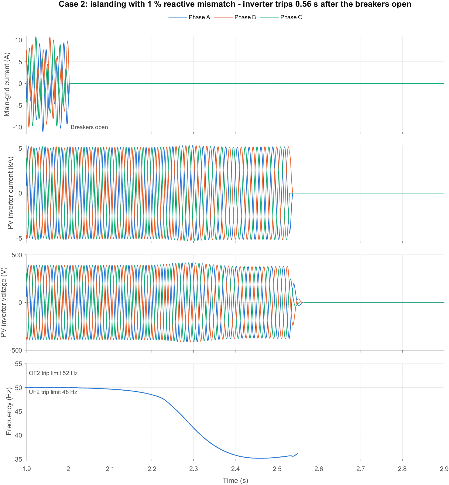

#### Case 3: fault during islanding

The island forms at 2.0 s (matched load) and each fault is applied at 2.3 s.

- The currents at the sending and receiving ends are zero, because both breakers are open.
- The inverter is the only source in the island. Its current rises briefly, then momentary cessation stops it injecting within about 55 ms of the fault (voltage below 0.5 pu).
- With no source left, the island voltage collapses to zero on all phases and does not recover after the fault clears. The island is de-energized between 2.42 s and 2.49 s in every case, that is within 0.5 s of the island forming.


#### Sending- and receiving-end voltage and current

Each figure shows the three-phase voltage and current at the sending end (main-grid side, left) and the receiving end (far-grid side, right) of the 3.3 kV feeder. The fault period is shaded and a vertical line marks the breakers opening. Voltages share one scale across all figures; currents share one scale within each case.

<details open>
<summary><b>Case 1: grid connected (fault at 2.0 s)</b></summary>

No fault. Each grid supplies 130 A per phase:

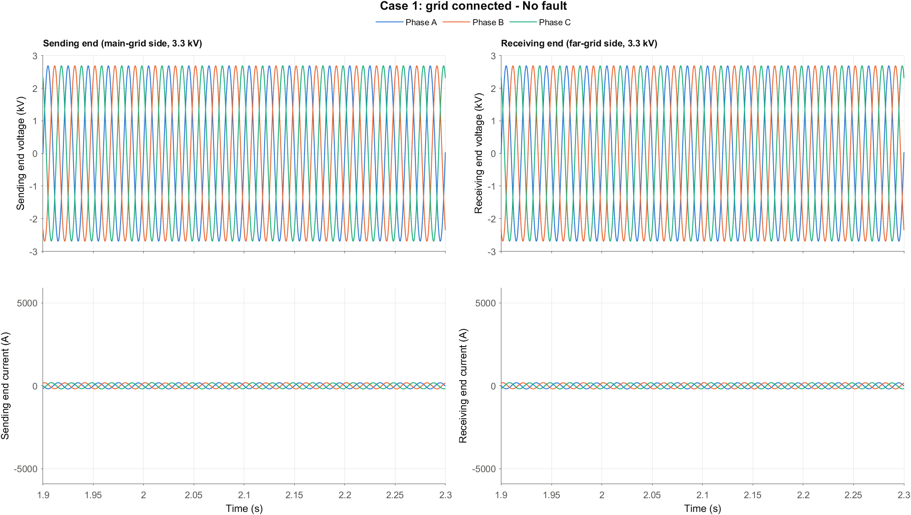

LG fault (A-G). Phase A current rises to 1,115 A RMS; the PV inverter stops and stays off, so the grids carry more load current afterwards:

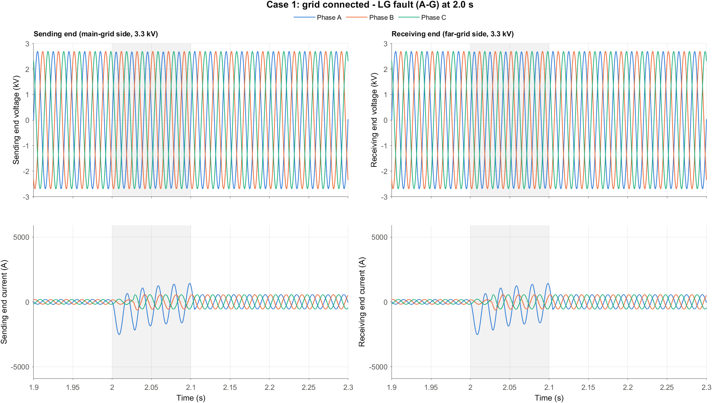

LL fault (B-C). Phases B and C rise to 1,660–2,060 A RMS:

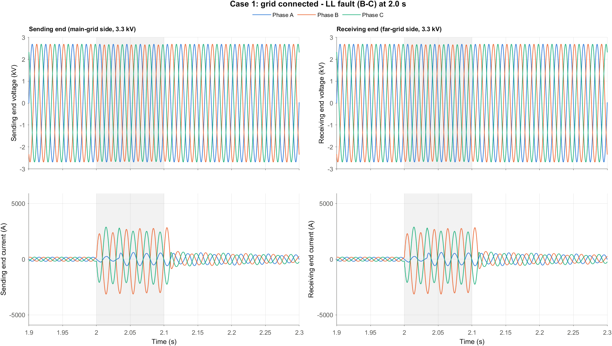

LLG fault (A-B-G). Phases A and B rise to 1,900–2,230 A RMS:

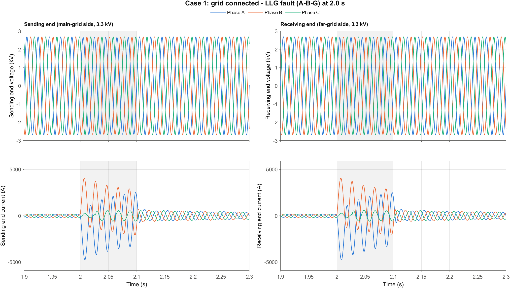

LLL fault (A-B-C). All three phases rise to 2,200–2,440 A RMS, with a first peak of about 5,500 A:

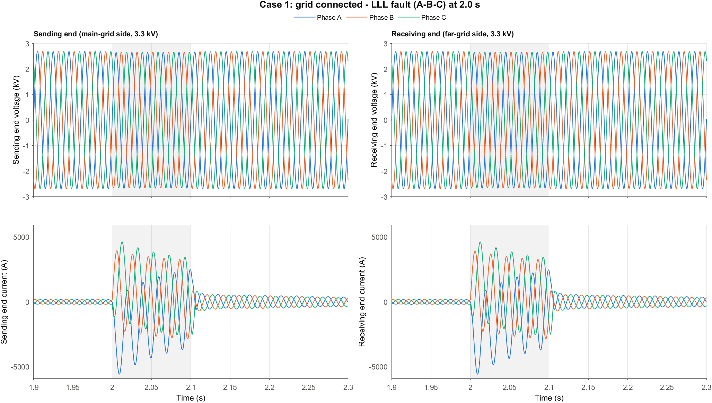

LLLG fault (A-B-C-G). The same as the LLL fault, because a balanced three-phase fault carries no ground current:

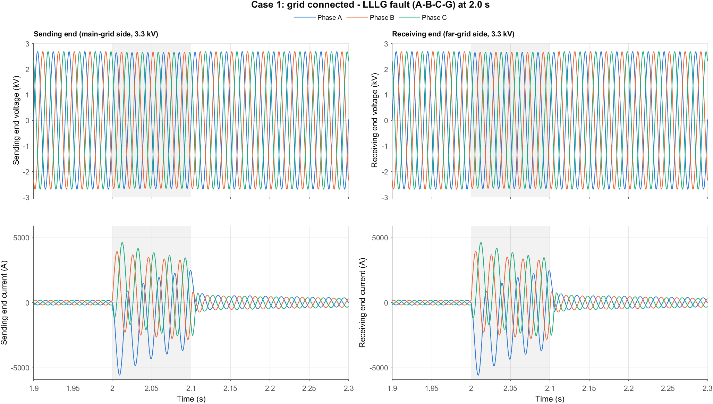

</details>

<details open>
<summary><b>Case 2: islanding (breakers open at 2.0 s)</b></summary>

Both currents drop to zero when the breakers open. The voltages stay at nominal because the PV inverter supplies the matched load:

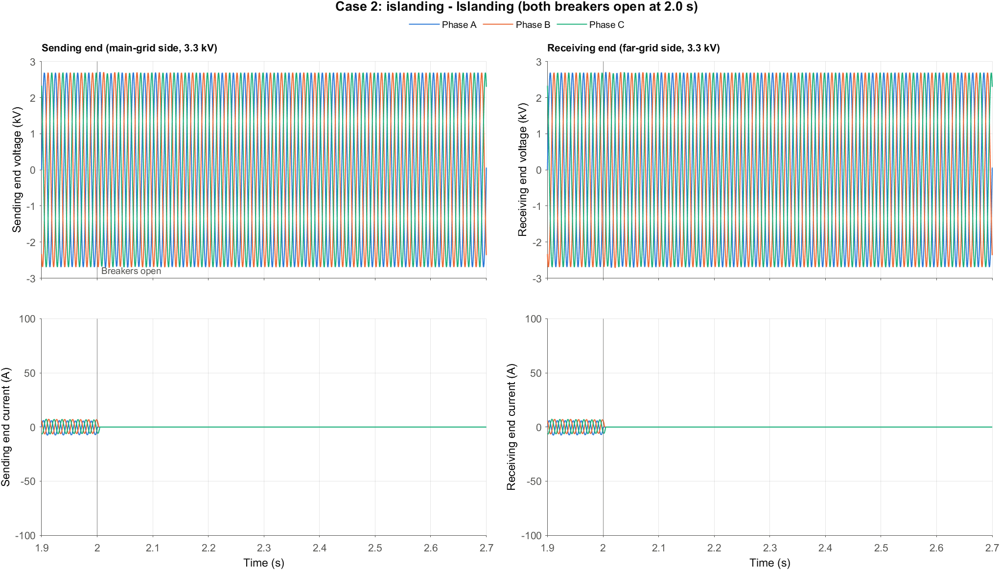

</details>

<details open>
<summary><b>Case 3: fault during islanding (island at 2.0 s, fault at 2.3 s)</b></summary>

The currents at both ends are zero because the breakers are open, so the fault shows only in the voltages. In every case the inverter stops injecting and the island voltage collapses.

LG fault (A-G). Phase A collapses at once; the other two phases follow within about two cycles:

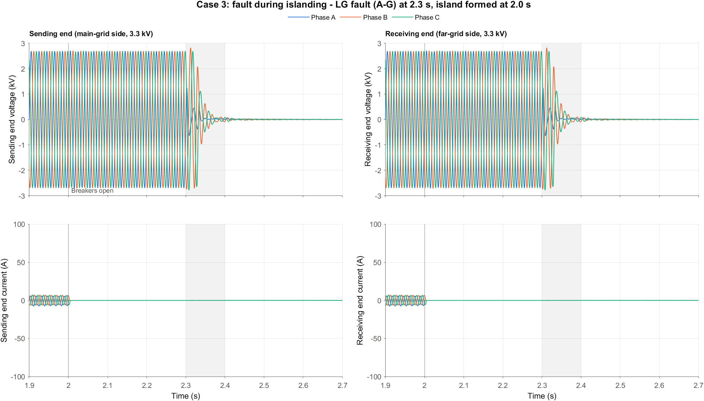

LL fault (B-C):

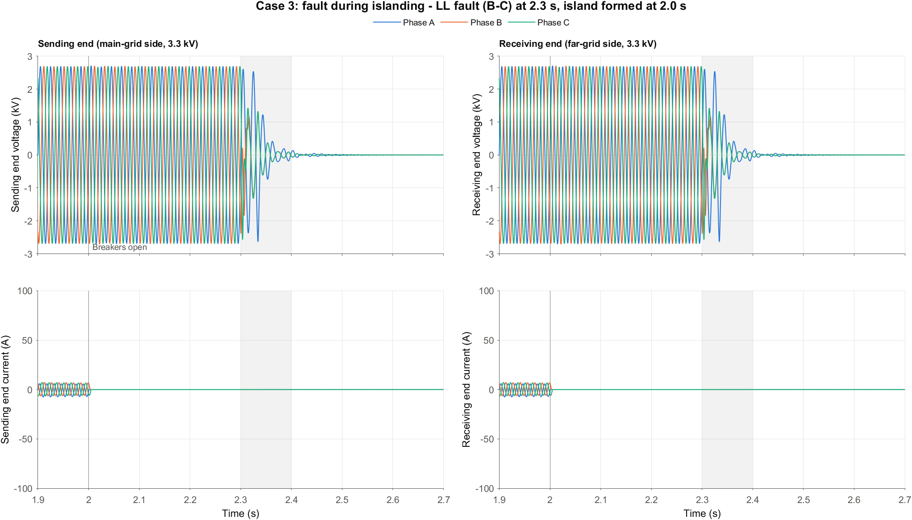

LLG fault (A-B-G). Phases A and B collapse at once; phase C follows:

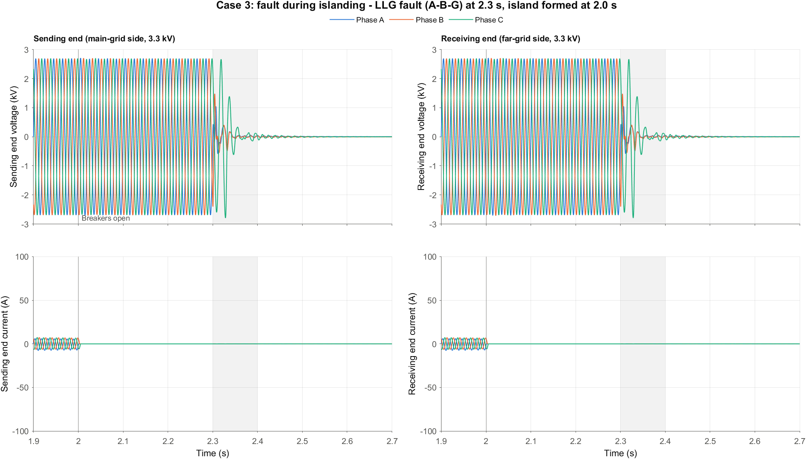

LLL fault (A-B-C). All three phase voltages collapse at once:

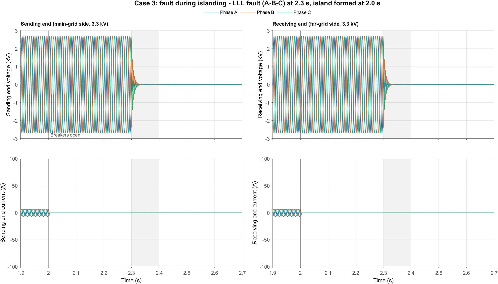

LLLG fault (A-B-C-G). The same as the LLL fault:


</details>

### 2026-10-04: Momentary cessation and frequency droop switched on

The model was checked against IEEE 1547-2018 beyond the 2 s islanding rule. Two functions that the standard requires for Category III were switched off in the inverter block and are now on. The figures and tables in the 2026-10-03 entry show the model with these functions on.

| Function | Clause | Setting | Before | Now |
|---|---|---|---|---|
| Momentary cessation | 6.4.2, Table 16 | `EnableMC` | off: the inverter kept injecting about 1.2 times rated current into faults | on: below 0.50 pu it stops injecting within 46–76 ms (the limit is 83 ms) |
| Frequency droop | 6.5.2.7 | `EnableFW` | off | on: 0.036 Hz deadband, 5 % droop |

After a fault clears, the inverter is back to 90–98 % of its pre-fault power within 0.4 s. The standard asks for at least 80 % within 0.4 s.

**Islanding detection is unchanged.** The reactive-mismatch sweep was repeated on the 3.3 kV feeder with both functions on:

| Reactive mismatch | Clearing time | 2 s limit |
|---|---|---|
| 0 % (perfect match) | no trip | not met |
| +1 % / −1 % | 0.556 s / 0.438 s | met |
| +2 % / −2 % | 0.487 s / 0.392 s | met |
| +5 % / −5 % | 0.437 s / 0.357 s | met |

**How the model compares with IEEE 1547-2018**

| Requirement | Standard | Model |
|---|---|---|
| Unintentional islanding (8.1.1) | detect and trip within 2 s | met for mismatches of 1 % or more; a perfectly matched island is not detected |
| Detection not based only on voltage and frequency trips (8.1, footnote 111) | additional method needed | active anti-islanding (derivative Sandia frequency shift) is on |
| Voltage trip settings (6.4.1, Table 13) | Category III defaults | same values |
| Overvoltage above 1.20 pu (Table 16) | cease to energize within 0.16 s | stops within 46 ms (LG fault, healthy phases at 1.34 pu) |
| Momentary cessation below 0.50 pu (Table 16) | within 0.083 s | 46–76 ms |
| Frequency droop (6.5.2.7) | mandatory for Category III | on |
| Enter-service voltage window (Table 4) | 0.917–1.05 pu | same values |

Limits of this comparison:

- IEEE 1547-2018 is written for 60 Hz systems. The frequency trip limits (52 / 51.2 / 48.5 / 46.5 Hz) and the enter-service frequency window (49.5–50.1 Hz) are adapted to 50 Hz by shifting the standard's values by −10 Hz.
- The enter-service delay is 0 s (the standard's default is 300 s; 0–600 s is allowed) so that a simulation does not take minutes.
- Compliance is demonstrated by type tests under IEEE 1547.1. These simulations show behaviour consistent with the standard; they do not certify compliance.
- Intentional islanding (clause 8.2) is not modelled.

## Reference

S. Khanal, S. Khadka, B. M. Pati and S. Parajuli, "Enhancing Transmission Line Fault Classification and Prediction of Fault Location Using ML and DL Techniques," *IET Generation, Transmission & Distribution*, 2026. https://doi.org/10.1049/gtd2.70390

## License

To be decided.
