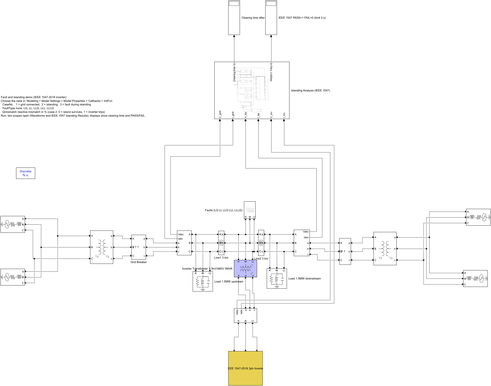
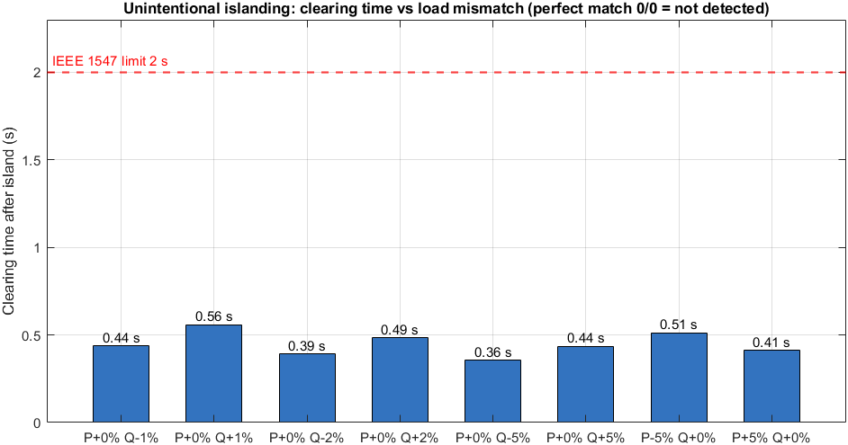
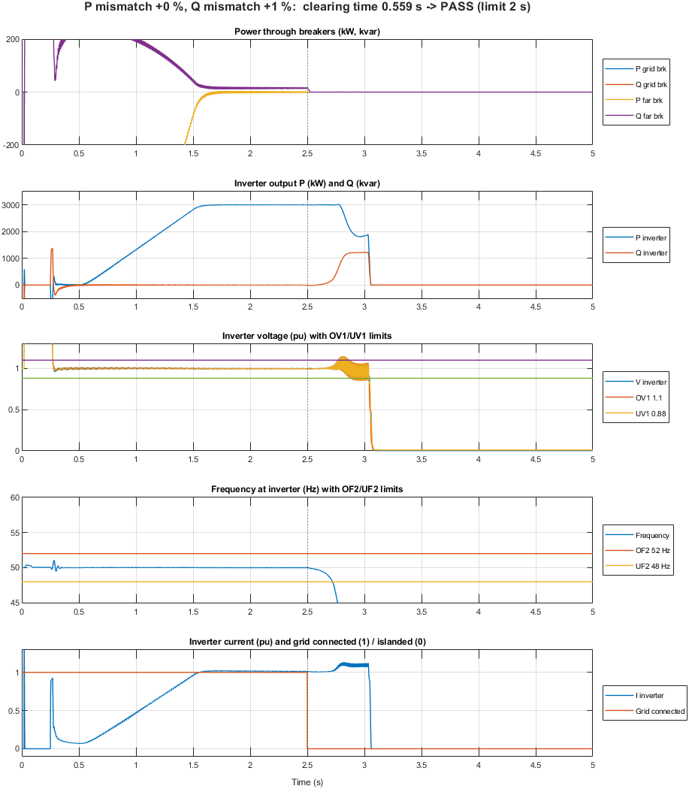
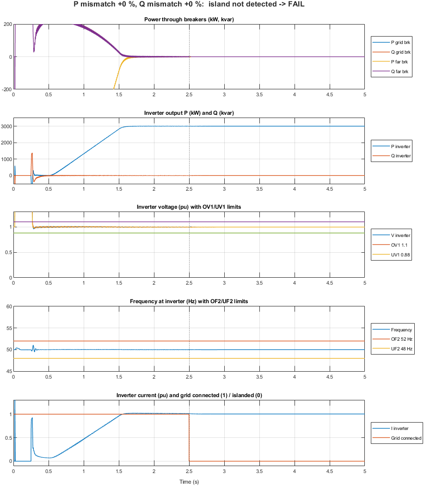
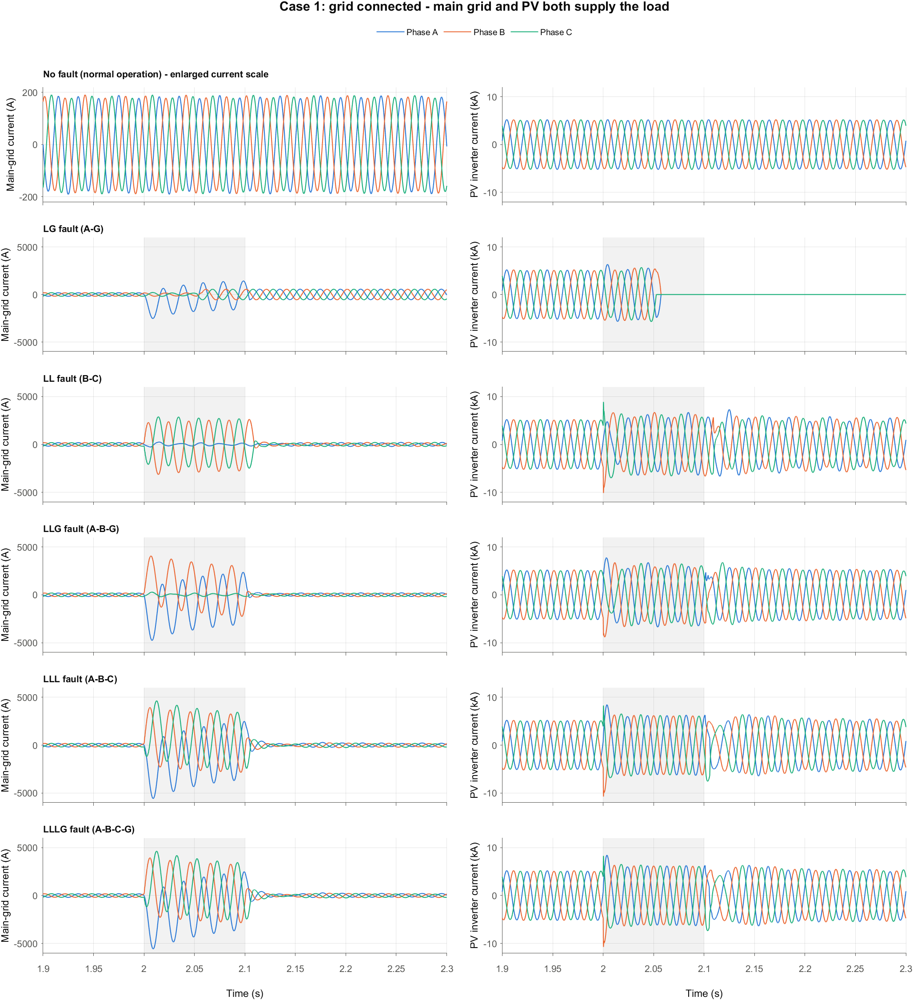
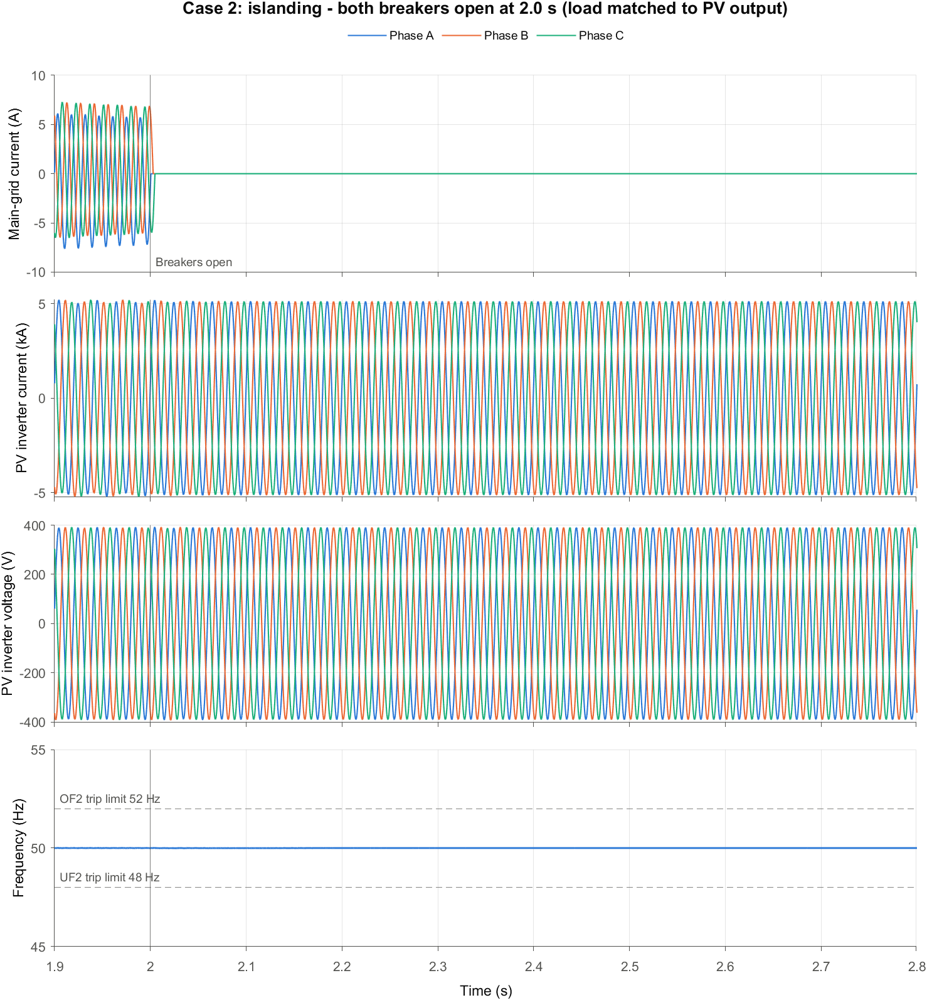
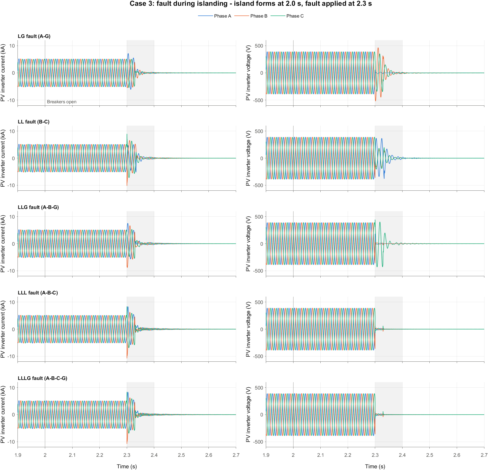

# fault-islanding-classifier

Fault and islanding classification in an 11 kV distribution network with an EPRI research inverter, built in MATLAB/Simulink.

## Overview

This project extends the study *"Enhancing Transmission Line Fault Classification and Prediction of Fault Location Using ML and DL Techniques"* (Khanal et al., IET Generation, Transmission & Distribution, 2026). That work simulated a transmission line in Simulink and used machine learning (Random Forest, CatBoost and others) and deep learning (ANN) models to classify LG, LL, LLG and three-phase faults and to predict fault location.

This repository takes the same approach and changes three things:

1. **Distribution network instead of transmission line.** The test system is an 11 kV radial distribution feeder.
2. **Inverter-based DER.** An EPRI research inverter model is connected to the feeder as a PV/DER source.
3. **Islanding.** Islanding events are simulated and classified alongside faults, so one model can tell faults, islanding and normal switching events apart.

## System description

| Item | Value |
|---|---|
| Grid source | 33/11 kV substation (modelled as a Thevenin source) |
| Feeder voltage | 11 kV, 50 Hz, three-phase radial |
| Lines | Overhead line sections (PI models) between buses |
| Loads | Balanced and unbalanced RLC loads at feeder buses |
| DER | EPRI research inverter (grid-following PV inverter) at a chosen bus, through an 0.4/11 kV transformer |
| Point of common coupling (PCC) | Circuit breaker between the DER section and the rest of the feeder, used to create islanding |
| Measurements | Three-phase voltages and currents at the substation and at the PCC |

### Features recorded

- Phase voltages and currents (magnitude and angle)
- Zero-sequence and negative-sequence components
- Frequency and rate of change of frequency (ROCOF) at the PCC
- Active and reactive power at the PCC

## Planned scenarios

| Class | Description |
|---|---|
| Normal | No fault, normal load variation |
| LG | Single line to ground fault (AG, BG, CG) |
| LL | Line to line fault (AB, BC, CA) |
| LLG | Double line to ground fault (ABG, BCG, CAG) |
| LLL / LLLG | Three-phase fault |
| Islanding | Grid breaker opens and the DER keeps supplying local load |
| Non-islanding events | Load switching, capacitor switching, DER power changes (to avoid false islanding trips) |

Each scenario is swept over:

- Fault location along the feeder
- Fault resistance
- Fault inception angle
- Load level and power mismatch between DER output and local load (for islanding)
- Measurement noise (SNR 0 to 50 dB)

## Machine learning

- **Task 1:** Event classification (normal, fault types, islanding, non-islanding events)
- **Task 2:** Fault location prediction along the feeder
- **Models:** Random Forest, CatBoost, XGBoost, SVM, KNN and ANN, as in the original paper

## Repository layout

```
fault-islanding-classifier/
├── models/
│   ├── feeder_11kV.slx          # 11 kV distribution network
│   └── epri_inverter/           # EPRI research inverter model (download separately)
├── scripts/
│   ├── run_faults.m             # sweeps fault scenarios
│   ├── run_islanding.m          # sweeps islanding and non-islanding scenarios
│   └── extract_features.m       # builds the feature table from simulation output
├── data/                        # generated CSV / MAT datasets
├── ml/                          # training and evaluation (MATLAB or Python)
└── README.md
```

## Requirements

- MATLAB and Simulink (R2023b or newer recommended)
- Simscape Electrical (Specialized Power Systems)
- Statistics and Machine Learning Toolbox
- Deep Learning Toolbox (for ANN)
- EPRI research inverter model for Simulink, downloaded from EPRI (not included in this repository; check its licence)
- Optional: Python 3 with scikit-learn, CatBoost and XGBoost for training

## How to run

1. Clone the repository and open MATLAB in the project folder.
2. Download the EPRI research inverter model and place it in `models/epri_inverter/`.
3. Add the folders to the path:
   ```matlab
   addpath(genpath(pwd))
   ```
4. Generate the fault dataset:
   ```matlab
   run_faults
   ```
5. Generate the islanding dataset:
   ```matlab
   run_islanding
   ```
6. Build the feature table:
   ```matlab
   extract_features
   ```
7. Train and evaluate the classifiers with the scripts in `ml/`.

## Progress

### 2026-10-01: Islanding test model (`Islanding_case.slx`)

The first working model of the islanding study.

**Network (11 kV, 50 Hz)**

```
Source, Source1 → T1 132/11 kV → Grid Breaker → V-I Meas1 ─●─ Line1 (33 km) ─●─ Line (33 km) ─●─ V-I Meas → Breaker1 → T 11/132 kV → Source2, Source3
                                                            │                   │                 │
                                                     Load 1.5 MW          11/0.48 kV 5 MVA   Load 1.5 MW
                                                                                │
                                                                     IEEE 1547-2018 inverter (3 MW)
```

**What was done**

- Added the IEEE 1547-2018 grid-following inverter (3 × 1 MW, 480 V) and connected it at mid-feeder through an 11/0.48 kV, 5 MVA transformer.
- Converted the inverter from 60 Hz to 50 Hz. About 30 hardcoded 60 Hz values inside the inverter (PLL, filters, frequency-watt, RMS blocks) now use the nominal frequency. The frequency trip settings were shifted by −10 Hz (OF2 52 Hz / 0.16 s, OF1 51.2 Hz / 300 s, UF1 48.5 Hz / 300 s, UF2 46.5 Hz / 0.16 s).
- Added a 0.3 Ω damping resistor to the inverter's LCL filter capacitor. Without it, the inverter oscillated at about 900 Hz against the long 11 kV line and tripped.
- Added `Grid Breaker` (main grid side). With `Breaker1` (far-end grid side), both breakers open at `Tisland` = 2.5 s, so the inverter and the two loads form a true island.
- Split the local load into two 1.5 MW RLC loads with quality factor 1.0. They are tuned so power through both breakers is about 0 before islanding (the matched-load, worst-case condition).
- Turned on the inverter's active anti-islanding function (EPRI Group 2c, derivative Sandia frequency shift).
- Added the `Islanding Analysis (IEEE 1547)` block. When the model runs, its scope shows breaker power flows, inverter P/Q, voltage, frequency and current against the trip limits. Two displays show the clearing time after island formation and PASS/FAIL against the 2 s limit of IEEE 1547-2018 clause 8.1.1.
- Removed the old measurement subsystems and scopes from the original model.

**Test settings** (Model Settings → Callbacks → InitFcn)

| Variable | Meaning |
|---|---|
| `Tisland` | time both breakers open (s) |
| `Pmismatch` | load active power change vs matched case (%) |
| `Qmismatch` | extra capacitive reactive power (% of 1.5 MW per load) |

**Results: unintentional islanding, IEEE 1547-2018 clause 8.1.1 (trip within 2 s)**

| Active mismatch | Reactive mismatch | Clearing time | Result |
|---|---|---|---|
| 0 % | 0 % (perfect match) | no trip | FAIL (non-detection) |
| 0 % | −1 % / +1 % | 0.439 s / 0.559 s | PASS |
| 0 % | −2 % / +2 % | 0.393 s / 0.486 s | PASS |
| 0 % | −5 % / +5 % | 0.358 s / 0.436 s | PASS |
| −5 % / +5 % | 0 % | 0.513 s / 0.413 s | PASS |

With a perfect match the island frequency stays at exactly 50.00 Hz. That is inside the ±0.15 Hz deadband of the anti-islanding function, so the island is not detected. Any mismatch tested (±1 % or more) is detected in under 0.6 s.

**Figures** (generated in MATLAB from `Islanding_case.slx`)

Simulink model:



Clearing time for each load mismatch case, against the 2 s limit:



Q mismatch +1 % (the slowest case): the anti-islanding function raises the inverter's reactive output after the island forms, the frequency falls through the 48 Hz trip limit, and the inverter trips 0.559 s after islanding:



Perfectly matched load (0 % / 0 %): voltage and frequency stay at nominal after islanding, so the island is not detected:



The voltage trip settings match the IEEE 1547-2018 Category III defaults (Table 13). The frequency trip table in IEEE 1547-2018 (Table 18) is defined for 60 Hz and was adapted to 50 Hz here.

**Next steps**

- Rerun the mismatch sweep with anti-islanding off, to separate its effect from the plain over/under-frequency trips.
- Follow the IEEE 1547.1 unintentional islanding test procedure (mismatch steps and ranges).
- Add fault scenarios (LG, LL, LLG, LLL) and non-islanding events, and start generating the ML dataset.

### 2026-10-03: Fault and islanding waveforms

A fault subsystem with five fault blocks (LG, LL, LLG, LLL, LLLG) was added at the mid-feeder bus, the same bus as the PV inverter transformer. Each case below is a separate simulation with the event applied after the inverter has reached full power. Faults last 0.1 s (5 cycles) and have 0.001 Ω fault resistance.

#### Case 1: grid connected, main grid and PV both supply the load

The loads are raised by 50 % (4.5 MW in total), so the PV supplies 3 MW and the two grids supply the rest. Fault at 2.0 s.

| Case | Main-grid current during the event (RMS, A / B / C) | PV inverter |
|---|---|---|
| No fault | 39 / 39 / 39 A | steady at 3 MW |
| LG (A-G) | 335 / 91 / 101 A | trips about 55 ms into the fault |
| LL (B-C) | 31 / 577 / 553 A | rides through |
| LLG (A-B-G) | 651 / 617 / 32 A | rides through |
| LLL | 750 / 673 / 683 A | rides through |
| LLLG | 750 / 673 / 683 A | rides through |



The no-fault row uses an enlarged current scale; the fault rows share one scale.

#### Case 2: islanding

Both breakers open at 2.0 s with the load matched to the PV output. The main-grid current drops to zero and the PV inverter keeps supplying the loads at 50 Hz and nominal voltage. This is the non-detection case: the island survives only because the load equals the PV output. With a 1 % reactive mismatch the frequency collapses and the inverter trips in 0.53 s (`figures/waveforms/Islanding.png`).



#### Case 3: fault during islanding

The island forms at 2.0 s (matched load) and each fault is applied at 2.3 s.

- The fault current is small. The PV inverter is the only source in the island and limits its current to about 1.2 times its normal value (about 4.3–4.5 kA RMS at 480 V, against 3.6 kA before the fault).
- The voltage shows the fault type: one phase collapses for LG, two phases sag for LL, two collapse for LLG, and all three collapse for LLL and LLLG.
- The island does not recover. After the fault clears the voltage decays, the frequency runs away to 67–76 Hz and the inverter trips at about 2.65 s in every case.



Per-case current graphs for the matched-load condition are in `figures/waveforms/`.

## Reference

S. Khanal, S. Khadka, B. M. Pati and S. Parajuli, "Enhancing Transmission Line Fault Classification and Prediction of Fault Location Using ML and DL Techniques," *IET Generation, Transmission & Distribution*, 2026. https://doi.org/10.1049/gtd2.70390

## License

To be decided.
